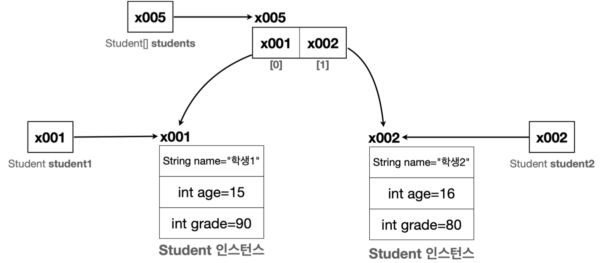

# Class

### ClassStart1 동작 과정
**1. 변수 선언**
- `Student student1`: Student 타입을 받을 수 있는 변수를 선언한다.

**2. 객체 생성**
- `student1 = new Student()`
  - 객체를 사용하려면 먼저 설계도인 클래스를 기반으로 객체(인스턴스)를 생성해야 한다.
  - `new` 키워드를 사용하여 `Student` 클래스 정보를 기반으로 새로운 객체를 생성한다.
    - 이러면 메모리에 실제 `Student` 객체(인스턴스)를 생성한다.
  - Student 클래스는 `String name`, `int age`, `int score` 멤버 변수를 가지고 있다.
    - 이 변수를 사용하는데 필요한 메모리 공간도 함께 확보한다.

**3. 참조값 보관**
- 메모리 어딘가에 만들어진 `Student` 객체의 주소값을 알아야 한다.
- 따라서 객체 생성 후 참조값(주소)를 반환해준다.
  - `student1 = x001`
- `x001`를 통해 `Student` 객체에 접근(참조)할 수 있다.

 

### 참조값을 변수에 보관해야 하는 이유
- 객체를 생성하는 `new Student()` 자체에는 아무런 이름이 없다.
- 이 코드는 단순히 Student 클래스를 기반으로 메모리에 실제 객체를 만드는 것이다.
- 따라서 실제 객체를 접근할 수 있는 방법이 필요한데, 그 이유로 참조값을 변수에 보관하여 쉽게 실제 메모리에 생성된 객체에 접근할 수 있도록 한다.

 

### 클래스, 객체, 인스턴스 정리
- **클래스 - Class**
  - 클래스는 객체를 생성하기 위한 '틀' 또는 '설계도'이다.
  - 클래스는 객체가 가져야 할 속성(변수)과 기능(메서드)를 정의한다.
    - 예를 들어 학생이라는 클래스는 속성으로 `name` , `age` , `grade` 를 가진다.
    - 참고로 기능(메서드)은 뒤에서 설명한다. 지금은 속성(변수)에 집중하자.
  - 틀: 붕어빵 틀을 생각해보자. 붕어빵 틀은 붕어빵이 아니다! 이렇게 생긴 붕어빵이 나왔으면 좋겠다고 만드는 틀일 뿐이다. 실제 먹을 수 있는 것이 아니다. 실제 먹을 수 있는 팥 붕어빵을 객체 또는 인스턴스라 한다.
  - 설계도: 자동차 설계도를 생각해보자. 자동차 설계도는 자동차가 아니다! 설계도는 실제 존재하는 것이 아니라 개념으로만 있는 것이다. 설계도를 통해 생산한 실제 존재하는 흰색 테슬라 모델 Y 자동차를 객체 또는 인스턴스라 한다.
- **객체 - Object**
  - 객체는 클래스에서 정의한 속성과 기능을 가진 실체이다.
  - 객체는 서로 독립적인 상태를 가진다.
    - 예를 들어 위 코드에서 `student1` 은 학생1의 속성을 가지는 객체이고, `student2` 는 학생2의 속성을 가지는 객체이
        다. `student1` 과 `student2` 는 같은 클래스에서 만들어졌지만, 서로 다른 객체이다.
- **인스턴스 - Instance**
  - 인스턴스는 특정 클래스로부터 생성된 객체를 의미한다.
  - 그래서 객체와 인스턴스라는 용어는 자주 혼용된다.
  - 인스턴스는 주로 객체가 어떤 클래스에 속해 있는지 강조할 때 사용한다. 예를 들어서 "`student1` 객체는 `Student` 클래스의 인스턴스다." 라고 표현한다.
- **객체 vs 인스턴스**
  - 둘다 클래스에서 나온 실체라는 의미에서 비슷하게 사용되지만, 용어상 인스턴스는 객체보다 좀 더 관계에 초점을 맞춘 단어이다.
  - 보통 `student1` 은 `Student` 의 객체이다. 라고 말하는 대신 `student1` 은 `Student` 의 인스턴스이다. 라고 특정 클래스와의 관계를 명확히 할 때 인스턴스라는 용어를 주로 사용한다.
  - 좀 더 쉽게 풀어보자면, 모든 인스턴스는 객체이지만, 우리가 인스턴스라고 부르는 순간은 특정 클래스로부터 그 객체가 생성되었음을 강조하고 싶을 때이다.

 

### ClassStart2 동작 과정 그림
